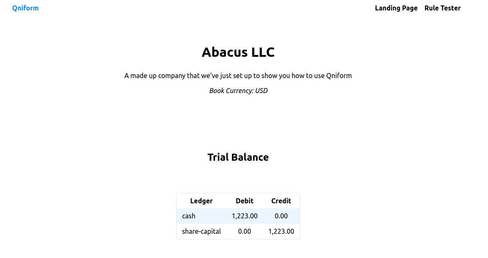

# Qniform Dev Diary
## 7th Sept
Created a dummy frontend for the "Qniform Event Tester", which allows a user to select a predefined event type from a dropdown, creates a form with the relevant fields to fill in, and applies the relevant rule to turn that into a transaction / journal entries.

Created a simple webserver with an 'event' POST endpoint, which validates the event and returns the consequent journal entries.

In both the above there are two rules defined - Equity injection and Invoice recieved.

## 8th Sept
Moved the backend rule definitions into a data file, with dynamic loading and creation of transforms.

Added a API route for querying the back end for the rules (specs and transforms), so they can be applied / validated on the frontend without hardcoding.

Improved the event API, adding some sad path handling for cases where the event spec validation fails, or the event just isn't recognized.

Added some regression tests to user namespace.

## 11th September
Added build file for backend.

The frontend now calls the backend for the rules, but doesn't apply them yet (the quoted forms for the transforms are causing some issues.)

I had to deal with CORS. 
I forget how it works every time, and still don't really understand it.
But it works.

## 18th September
### Persistance and knowledge datetimes
Added persistance (SQLite DB) for journal entries, and a DB layer with functions `book-journal-entries` and `get-journal-entries`.
In addition to handling the mechanics of the DB writes and reads, it handles (and abstracts) any translation needed for turning domain models to DB schema and vice versa. 

```clojure
(def journal-trans
  {:event-id :event_id
   :je-type :je_type
   :update-of :update_of
   :dr-cr :dr_cr
   :local-amount :local_amount
   :effective-date :effective_date
   :knowledge-datetime :knowledge_datetime})

(defn domain->db [key-map domain-trans]
  (update-keys domain-trans #(or (key-map %) %)))

(defn db->domain [key-map domain-trans]
  (update-keys domain-trans #(or ((map-invert key-map) %) %)))
```

I also added an `accounting` namespace which will handle the busiess logic related to accounting.
Right now it:

* contains the specs for the different types of journal entries (new, correction, nullification) using the domain model.
* A `book-journal-entries` of its own, which handles validation and calls the DB (though it's pass-through for the DB call, it should return something better.)
* Functions for aggregation of JEs,.`filter-on-datetime`, `aggregate-je`, and `trial-balance`.

All of these are focused on an important concept for this system, and for accounting systems generally.
The 'event log' of journal entries is bitemporal[^1].
There is a date dimension for when something actually happened (called the **effective date**), and a second, totally separate one for _when you knew about it_ (called the **knowledge date**, and actually a datetime.)

[^1]: Actually you could argue _tritemporal_ when you start adding concepts of 'closing' into the mix.

I won't go into why this is so important, but it has some important consequences for implementation.
First, your log of entries has to be, in effect if not literally, immutable and append only.
If you book an expense entry on the 15th of the month for $20, and on the 5th of the _next_ month you go back and change that entry so it is $30, you can't just update in place because you'll need to know that at a point in time you _thought_ your expense was $20 even though you now know it's $30[^2].

[^2]: Many accounting systems have a weaker version of this concept, where you can update-in-place up to the point where you "Close" the books at a given date, meaning you can't change anything before that close point, and have to book 'adjusting' entries. These systems often conflate knowledge and effective date, and are generally unsuitable to anything other than trivially small usecases.

As a consequence our journal entry database is append only.
To 'change' an entry, you have to either 'correct' it (supply the correct entry, with a reference to the original transaction) or 'nullify' it, which just removes it.
But none of these entries are touched after initially being booked.
So when you query the database you're potentially going to get back multiple rows for a single journal entry, which need to be aggregated into a single entry[^3].

[^3]: Really identical to 'projection' in an event sourcing system. Which ultimately is what this is, but hopefully without the jargon and hype.

This is an important detail the accounting namespace is hiding:
The implementation of the event history.
In this namespace, everything you do should have the option to supply a 'knowledge datetime', and the values returned will be 'journal entries' showing what you knew at that time, with no exposure of the 'new, correct, nullify' concepts that actually live in the database.

```clojure
(defn filter-on-datetime [datetime jes]
  (remove #(t/date> (:knowledge-datetime %) datetime) jes))

(defn aggregate-je
  "given a set of jes and a datetime, will return the set of JEs representing the known state of the system as at that datetime."
  ([jes]
   (vals (reduce (fn [A entry]
                   (case (:je-type entry)
                     "new" (assoc A (:id entry) (assoc entry :corrections []))
                     "correct" (update A (:update-of entry) (update entry :corrections conj (:update-of entry)))
                     "nullify" (dissoc A (:update-of entry))))
                 {}
                 jes)))
  ([jes datetime]
   (aggregate-je (filter-on-datetime datetime jes))))

(defn- tb-signed->drcr [tb]
  (update-vals tb #(if (neg? %) [:cr (abs %)] [:dr %])))

(defn trial-balance [jes]
  (tb-signed->drcr (reduce (fn [A entry]
                             (update A (:account entry)
                                     (if (= "debit" (:dr-cr entry)) + -)
                                     (:local-amount entry)))
                           (zipmap (set (map :account jes)) (repeat 0))
                           jes)))
```

### MVP
I defined what the MVP for this effort is.
In short, I want a landing page which can be used for pitching.
In addition to a few paras describing the product, this means having a sort of 'try it now' feature that will guide the users through the key functionality of the program.
Here's the list.

1. User has landing page where they can see the pitch and features and get to the 'try it now' page.
2. User can set up new ledger, with name, book-ccy.
3. User can set up upstream system
4. User can define event / rule for that system
5. User can manually input and submit an event that gets turned into jes
6. User can see TB and dig into general ledger
7. User can look at JE and get to Transaction / Event
8. User can manually update an event, generating correction entries, and see the impact of that in TB/GL
9. User can close the books.

One thing I would like to have in there as well, though this is probably the next phase, is a 'simulate' option. 
The user can do all of the above, but then can hit a 'simulate' button, which will start generating events based on the rules, and closing the books.
This should highlight what is the key attribute of Qniform, which is the touchless operation.

## 21st September
Tidy up the landing page with [MVP.css](https://andybrewer.github.io/mvp/), and add a simple nav bar and page navigation.
Also, add a "Try" page, which is navigated to when the user clicks the "Try it Now!" button from the landing page.

From this page, the user should be presented with a page representing a dummy entity/general ledger[^4].

[^4]: It is possible to have multiple general ledgers for a single entity, but we avoid that complexity for now.

This is the main entity screen. From here you should be able to see, or navigate to, the TB, GL, Rules, and Events.
(Ultimately there should be some sort of period selector here, but not necessary for now)
The GL (or a GL ledger) you can get to by drilling down into the TB.
You can also get there by going through events, selecting one that will show you the transaction/entries, and from there to the ledgers.

Start with the TB.
A simple table to start with:

```
      DR    CR
acc1   -     -
acc2   -     -
acc3   -     -
acc4   -     -
```

Obviously, it will be empty at first.
We'll serve this up from the backend, which requires adding a TB endpoint.

A quick tangent: Up to now I've been starting the front and backend separately.
That's a pain, so I want to do it together, following [this guide.](https://blog.agical.se/en/posts/shadow-cljs-clojure-cljurescript-calva-nrepl-basics/)

It was actually really easy! I was _not_ expecting it to be.
One thing I couldn't get working: I have a 'build' defined in `shadow-cljs.edn` and an _alias_ (dev) defined in deps.edn. I can't figure out how to start both of them at one.
Not a problem for now.

Now, merge the branch in.

...

Well I messed that up apparently. The feature branch is now main on GH remote origin. Oh well.

Now, to add the TB endpoint.
Should be pretty trivial with the accounting NS from a couple of days back.

...

I changed the spec of the TB row a bit:

```clojure
;; from
{:tb-row [:dr 1000]}
;; to 
{:tb-row [1000 0]}
```

The numerical part of the row is always going to be a debit and a credit, so it's easier to have that as the format.

The API endpoint was indeed trivial:

```clojure
(defn trial-balance-request [_]
  (merge
   {:headers {"Content-Type" "application/json"}}
   {:body (-> (acc/get-journal-entries!)
              acc/aggregate-je
              acc/trial-balance
              json/write-str)}))
```

And the frontend simply a matter of displaying as a table:



It's not interactive right now (eventually this should be a path to access the underlying ledger itself.), and obviously it has actual data in it, which it shouldn't at this point.
Next, I'd like an overlay modal which points to the TB and says something like:

> This is the trial balance of Abacus. 
> Right now, there is nothing in it, since we haven't booked any activity yet.

Then, after clicking OK a new modal over the 'connected systems' section, which should have a 'new system' button.

> Let's fix that by setting up our first connected system and event rule.
> Click "New" here to go to the rule setup screen.

The first rule is going to be to issue some capital.
We'll assume that the accountant has some upstream system which is sending them share capital events.
(This is pretty unlikely.)

> The first thing a company generally does is issue some share capital.
> At the heart of Qniform is the presumption that you will not be booking entries yourself
> Instead, you will be processing _events_, and setting up _rules_ for how to process those events into double-entry journals.
>
> Further, Qniform expects that the accountant is not creating these events themselves, but _subscribing_ to events published by an upstream system.
> In this way, Qniform can be a truly hands-off accounting system.
>
> For this example, we will presume you have an upstream system for managing company corporate events, like the issuing of share capital.
> (Don't worry if you don't, Qniform will still work fine if you want to input a few events manually, or get your legal team to do it.)
>
> First, make the system name - let's say it's called "Corporate System".

For this, we'll need the following:

* A section on the try page for "Systems", preferably to the right of the TB.
* An 'Add system' button.
* _NOT_ backend persistence of systems yet - that can wait, live in the frontend for now

## 22nd September
### Thinking about systems and events
Let's think about the model for systems and events more carefully.
So the accountant is going to maintaining the GL for an entity.
But probably several entities, all of which share upstream systems.
So the 'attachment' of a system can't be the GL/Entity itself.
It has to be the account, which there is no concept of right now.
So the user should be able to set up a new system from the GL screen, but they should be accessible ("loadable") from the account level.

So much for systems. Now for events.

Events have some of the same characteristics as systems:
They are likely to be shared across GLs.
For example if you have an upstream payroll system that handles employees of multiple companies, the salary payment events coming out of it are likely to be identical, with the only difference being the manco they relate to.
However, it's not _so_ simple.
There might be subtle differences between companies, both in the events themselves and in how they are translated to journal entries, for local accounting rules.

So for these we have to walk the line between sharing for ease of use across GLs, and allowing variation between GLs to accomodate local changes.

This is, of course, the problem that comes up in every product ever.

Let's play out a scenario:

1. The user sets up an upstream payroll system X for GLs A,B and C.
2. She sets up an event E1 for X/A for salary payments.

```
originating-system: X
os-identifier:      abc
event-type:         salary-payment
management-company: A
currency:           USD
local-amount:       1,000
// plus date, comment, etc.
```

3. She sets up a rule for E1, which translates the event into journal entries.

```
event-id:     abc
dr-cr:        cr
account:      cash
je-type:      new
local-amount: 1,000
// etc.
```
### Assignment: Connecting events to GLs

Even before getting to the question of extending this, how does 'assignment' of this event to a particular GL work?
The API endpoint is just `api/event`. 
How does Qniform know to apply this event to GL A?

Here are the options:

#### *The upstream system can indicate which Qniform GL it relates to*
Fo examples as a query param for the api endpoint: `api/event?gl=A`.
I don't love this.
This pushes the accounting domain model (general ledgers) to upstream systems.
I don't think that should be their responsibility.

#### *The upstream system describes what **legal entity** it relates to*
This is better, because it decouples from the accounting context, by adding legal entity as an intermediate model.
Both the upstream system and Qniform are free to interpret that how they like.
Legal entity is a great intermediary for identification because it's universally accepted (enforced by law).
There are still some problems, the biggest being having a golden source for what those entities are. 
But that is solvable.
This can be implemented either as query params (`api/event?entity=A`) or as part of the events (in the body of the event `entity=A`) but it amounts to the same thing.

What if the upstream system _doesn't know_ the entity though? The big example I can think of here is an IBOR system, which has a _portfolio_ model, not an entity model.

#### *Qniform unilaterally decides assignment*
This is the most flexible.
Say the above event comes in: the event definition would have some logic to decide how to assign the event to a particular GL.

## 30th September
### Basic system setup
Time to do upstream system set up.
Start of very simple: A system with a name and description, and show it with a card.

I added a `systems-summary-component` to do this, standard global atom with system names and form.

Next is adding an event / rule for the system.
I'll do the event first, since rule is going to be _hard_ I think.
The event thing in theory is just letting the user describe a map and turning it into a Malli spec.

```
Event Name: Text
Share: Whole Number
Price Per Share: Currency
Comment: Text
```

to

```clojure
[:map
 [:event-id :string]
 [:shares :int]
 [:price-per-share money]
 [:comment :string]]
```

To start I put in functionality to select a system: you click it and the others, if any, are hidden, and the selected one spans the screen.

### Tutorials
I want the 'try' functionality to act like a tutorial, guiding the user through the process.

First, making the 'tutorial' text a bit more distinguised from 'normal' text. I just made it Blue and Italic.

I also put some 'reactivity' in there.
For example, before the user has set up a new system, they are shown the "Add new system by..." text.
But after a system is created, they are told to select the system by clicking it instead.

I think this will need to be expanded a lot, to the extent of having some global state tracking the users progress through the tutorial.

...

I did a bit of that, seems to work well.

## 1st October

Setting up events.
VERY ugly right now, and the functionality is a bit off (for example, the way you can add as many new rows as you like.)
But it works OK.
